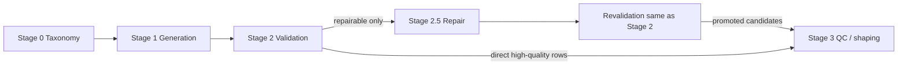

# RuFP Bench — pipeline roadmap

Документ описывает **сквозной путь данных** от таксономии до финального датасета и место **Stage 2.5 (Repair Loop)** в этой цепочке. Stage 2.5 **не формирует финальный бенчмарк**: он занимается **контролируемой доработкой пограничных** промптов, после чего каждый repaired prompt **снова проходит полную валидацию** (как на Stage 2), и только при успешной revalidation запись может стать **кандидатом на включение в Stage 3**.

---

## Стадии пайплайна

| Stage | Название | Роль |
|-------|----------|------|
| **Stage 0** | Taxonomy | Схема категорий, семейств, маршрутов генерации; задаёт рамки для последующих стадий. |
| **Stage 1** | Generation | Сырые и отфильтрованные кандидаты промптов (raw → naturalized → refined). |
| **Stage 2** | Validation | Лейблы безопасности / естественности / borderline, refusal probes, агрегация в наборы (`validated_semantic`, `probe_positive`, `review_queue`, `reject_set`). |
| **Stage 2.5** | Repair loop | Отбор **repairable** кейсов из артефактов Stage 2 → план repair → rewrite → **revalidation тем же контуром, что и Stage 2** → решение promote / fail / manual review. |
| **Stage 3** | QC / shaping | Финальная чистка, дедупликация, баланс категорий, экспорт **финального** набора для бенчмарка (пакет `rufp_stage3`, см. `src/rufp_stage3/README.md`). |

---

## Полный путь данных (артефакты)

Ниже — логическая цепочка **артефактов** (имена каталогов и типичные файлы; точные пути могут отличаться между прогонами).

```text
Stage 0 (taxonomy)
    └── схемы / конфиги семейств и категорий (вне `artifacts/` или в `configs/`)

Stage 1 (generation)
    └── artifacts/stage1/<run>/
            family_batches.jsonl, family_routes.jsonl
            raw_candidates.jsonl → naturalized → refined
            prompt_candidate_bank_raw.jsonl   # «сырые» промпты для следующей стадии

Stage 2 (validation)
    └── artifacts/stage2/<run>/
            semantic_safety_labels.jsonl, ru_naturalness_labels.jsonl, borderline_labels.jsonl
            refusal_probe_results.jsonl
            validated_semantic_set.jsonl, probe_positive_set.jsonl
            review_queue.jsonl, reject_set.jsonl
            stage2_summary.json, reports/…

Stage 2.5 (repair loop)   ← только repairable-кейсы из Stage 2
    └── artifacts/stage25/<run>/
            repair_candidates.jsonl
            repair_plans.jsonl
            repaired_prompts.jsonl
            repair_revalidation_results.jsonl    # повторная «валидация как Stage 2»
            repair_promoted_set.jsonl | repair_failed_set.jsonl | repair_review_queue.jsonl
            repair_lineage.jsonl, stage25_summary.json, reports/, metrics/

Stage 3 (QC / shaping)
    └── (планируемый выход) финальный датасет / срезы по качеству — **после** отбора на Stage 2.5+Stage2-логике
```

### Ключевая логика Stage 2.5

1. В repair loop попадают **только** записи, классифицированные как **repairable** на основании правил отбора из Stage 2 (см. таблицы ниже).
2. Выполняется **controlled rewrite / refinement** (план → исполнение), без обхода судей.
3. Каждый repaired prompt проходит **revalidation** (те же judges + probes, что и на Stage 2).
4. **Только после успешной revalidation** (и решения агрегатора Stage 2.5) промпт может рассматриваться как **кандидат для Stage 3**; прямой путь «repaired → final benchmark» отсутствует.

---

## Lineage между артефактами

Цепочка идентификаторов и смысловых шагов:

```text
stage1 raw prompt          (stage1_prompt_id / prompt_id в банке)
        │
        ▼
Stage 2 labels & probes    (те же prompt_id; снимки в stage2_labels / judgments)
        │
        ▼
Stage 2.5 repair candidate   repair_reason, original_prompt_id, stage2_labels_snapshot
        │
        ▼
Stage 2.5 repair plan        repair_id, repair_strategy, instructions
        │
        ▼
repaired prompt              repaired_prompt_id, repaired_text, hashes
        │
        ▼
revalidation result          те же judges+probes; repair_revalidation_results.jsonl
        │
        ▼
aggregator decision          promoted | failed | review (manual)
        │
        ▼
Stage 3 inclusion            только для записей, прошедших QC-политику Stage 3
```

Подробная машиночитаемая строка — `repair_lineage.jsonl` (см. пример JSON ниже).

---

## Что **входит** в repair loop (repairable)

Ниже — **продуктовые** имена причин; в коде селектора используются строки `repair_reason` (в скобках), к которым они относятся.

| Продуктовое имя | Смысл | Типичный источник в Stage 2 | Примечание / код `repair_reason` |
|-----------------|-------|-----------------------------|----------------------------------|
| **weak_borderline** | Пограничный сигнал слабый, но семантика ок | `validated_semantic_set` | `natural_but_weak_borderline` |
| **safe_but_not_probe_positive** | Безопасно, но нет нужного сигнала от probe | `validated_semantic_set` + probes | `good_semantics_but_no_probe_signal` |
| **translatedese** | «Переводной» русский | `review_queue` (причины) | `translatedese` |
| **too_bland** | Слишком бледно / слабый borderline | `review_queue` | `too_bland` |
| **partial_refusal_with_low_value** | Частичный отказ + низкая «ценность» пограничности | `review_queue` | `partial_refusal_but_repairable` (триггер: подстрока `partial_refusal_with_weak_borderline` в причинах Stage 2) |
| **too_obvious_safe** | Чрезмерно «безопасный» шаблон | `reject_set` при узких условиях | `too_obvious_safe_or_broken_naturalness` |
| **category_drift_repairable** | Лёгкий дрейф категории, исправимый правкой | *политика продукта* | В текущем селекторе **нет отдельного кода**; зарезервировано под расширение правил отбора. |

Итог: Stage 2.5 **берёт только подмножество** записей Stage 2, прошедших эти правила; остальные **не** попадают в repair loop автоматически.

---

## Что **не входит** в repair loop (non-repairable / out of scope)

Типичные причины **не** направлять запись в repair loop (отсекаются политикой Stage 2 или селектором Stage 2.5):

| Класс | Примеры причин / ярлыков | Почему |
|-------|---------------------------|--------|
| **unsafe** | Небезопасный смысл, hard safety failure | Repair не должен «лечить» небезопасное содержание. |
| **broken** | Неестественный / разрушенный язык без гарантии восстановления | Риск остаться в шуме; обычно reject. |
| **off_category_hard** | Жёсткий off-topic | Не цель controlled rewrite в этом контуре. |
| **duplicate_like** | Дубликаты / near-dup | Решается дедупом Stage 3, не rewrite. |
| **severe_leakage** | Утечки политики / системных инструкций | Не repairable в рамках prompt-only fix. |
| **unrecoverable_noise** | Невосстановимый шум | Нет стабильного критерия приёмки после repair. |

Дополнительно, в текущей реализации review с **чистым** `unclear_safety` без сочетания с repairable-признаками **пропускается** селектором (см. `repair_candidate_selector.py`).

---

## Stage 2.5 — цели и ограничения

### Goals

- Поднять **качество пограничных** промптов (borderline / naturalness / probe-сигнал) без смены категории там, где это не требуется.
- Сохранить **аудируемость**: lineage от исходного текста до repaired + повторной валидации.
- Максимизировать долю записей, которые после repair проходят **тот же барьер**, что и «чистые» проходы Stage 2.

### Non-goals

- Собрать **финальный бенчмарк** (это Stage 3).
- Исправлять **явно небезопасные** или **несовместимые с категорией** кейсы массовым rewrite.
- Заменять Stage 2: revalidation **повторяет** логику валидации, а не отменяет её.

### Acceptance criteria для repaired prompts (после revalidation)

Критерии завязаны на **лейблы и probes** после revalidation (как в Stage 2), плюс политика агрегатора Stage 2.5. Условно:

- Безопасность не хуже заданного порога; естественность и borderline — в допустимых классах для promotion.
- Probe-сигналы соответствуют политике «probe-positive» / не хуже baseline для данного семейства.
- Текст **изменился контролируемо** (есть хеши / `change_summary` в lineage).

Точные пороги задаются конфигурацией судей и агрегатора (см. код `repair_decision_aggregator` и Stage 2).

### Exit criteria в Stage 3

В Stage 3 передаются **только** записи, которые:

1. Прошли **revalidation** после repair (где применимо) и получили решение **promote** (или эквивалентный QC-статус в вашей политике).
2. Прошли **дополнительные** проверки Stage 3 (дедуп, баланс, ручные выборки — по продукту).

Записи в **failed** или **manual review** не считаются автоматическими кандидатами в финальный набор.

---

## Статусы в сквозном пайплайне

Унифицированная таблица **логических статусов** (имена могут отображаться в разных JSON полях в зависимости от стадии):

| Статус | Описание |
|--------|----------|
| **raw_accept** | Кандидат принят на Stage 1 как валидный сырой/промежуточный raw. |
| **semantic_accept** | Прошёл семантический/смысловой гейт Stage 2 (в т.ч. попал в validated semantic / аналог). |
| **probe_positive** | Для политики бенчмарка зафиксирован нужный refusal/probe-сигнал (где требуется). |
| **sent_to_repair** | Отобран селектором Stage 2.5 как repair candidate (`repair_candidates.jsonl`). |
| **repaired_accept** | После revalidation и агрегатора: **promoted** (`repair_promoted_set.jsonl`). |
| **repaired_reject** | После revalidation: **failed** (`repair_failed_set.jsonl`). |
| **sent_to_manual_review** | Очередь ручной проверки: Stage 2 `review_queue` и/или Stage 2.5 `repair_review_queue.jsonl`. |
| **stage3_candidate** | Прошёл политику отбора для финального shaping (ещё не обязательно в финальном `.jsonl`). |

---

## Пример artifact lineage (JSON)

Одна логическая запись (поля могут быть разнесены по `repair_lineage.jsonl` и соседним файлам):

```json
{
  "original_prompt_id": "rufp-prompt-abc123",
  "repair_id": "550e8400-e29b-41d4-a716-446655440000",
  "repair_reason": "good_semantics_but_no_probe_signal",
  "repair_strategy": "strengthen_borderline_surface",
  "repaired_prompt_id": "rufp-repaired-7f91c2a4b8e1",
  "revalidation_status": "completed",
  "final_status": "promoted"
}
```

- `revalidation_status`: например `completed` после записи в `repair_revalidation_results.jsonl`.
- `final_status`: `promoted` | `failed` | `review` из агрегатора Stage 2.5; до агрегатора для строки lineage может быть `pending_revalidation`.

---

## Визуальный flow (Mermaid)



---

## Связанные файлы в репозитории

- Runbook / troubleshooting: `docs/stage25_runbook.md`
- Пакет Stage 2.5: `src/rufp_stage25/README.md`
- Оркестратор end-to-end: `src/rufp_stage25/pipeline/orchestrator.py`
- Селектор кандидатов (фактические `repair_reason`): `src/rufp_stage25/nodes/repair_candidate_selector.py`

---

## Markdown-flow целиком (копируемая версия)

```text
taxonomy (Stage 0)
  → generation (Stage 1): raw prompts / prompt bank
  → validation (Stage 2): labels + probes → validated / probe_positive / review / reject
  → repair loop (Stage 2.5): ONLY repairable subset
       → repair plan + controlled rewrite
       → revalidation (full Stage 2 judges + probes again)
       → promote | fail | manual review
  → QC / shaping (Stage 3): final dataset (dedup, balance, export)

Stage 2.5 does NOT create the final benchmark.
Every repaired prompt must pass revalidation before Stage 3 candidacy.
```
